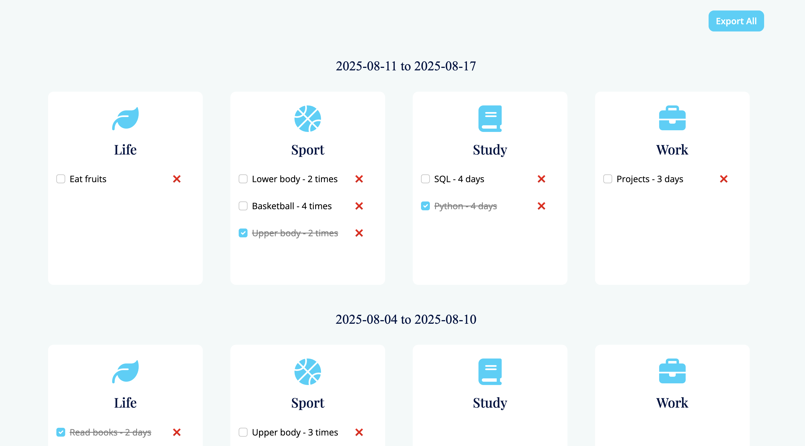
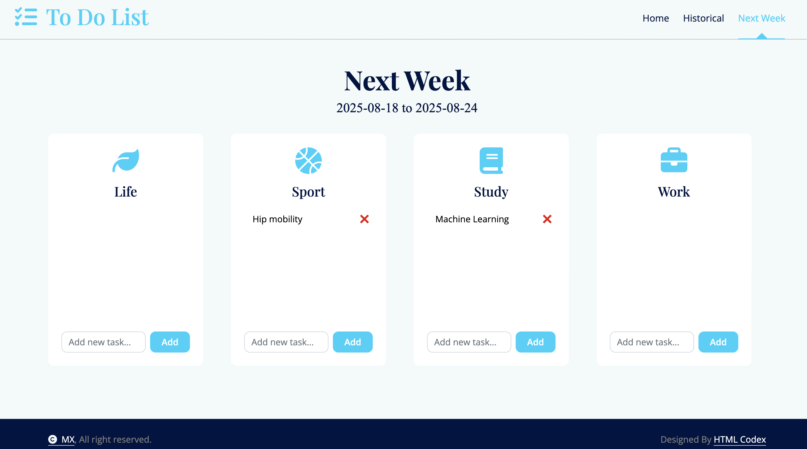

# Weekly To Do List
Weekly To-Do List is a Flask app I built to track weekly tasks. 

### Home  
  

**Functionality:**  
- Add or delete items  
- Mark tasks as done  
- Copy last week’s list

### Historical

**Functionality:**  
- View the past tasks
- Download historical tasks  

### New Task

**Functionality:**  
- Create new tasks for next week  

